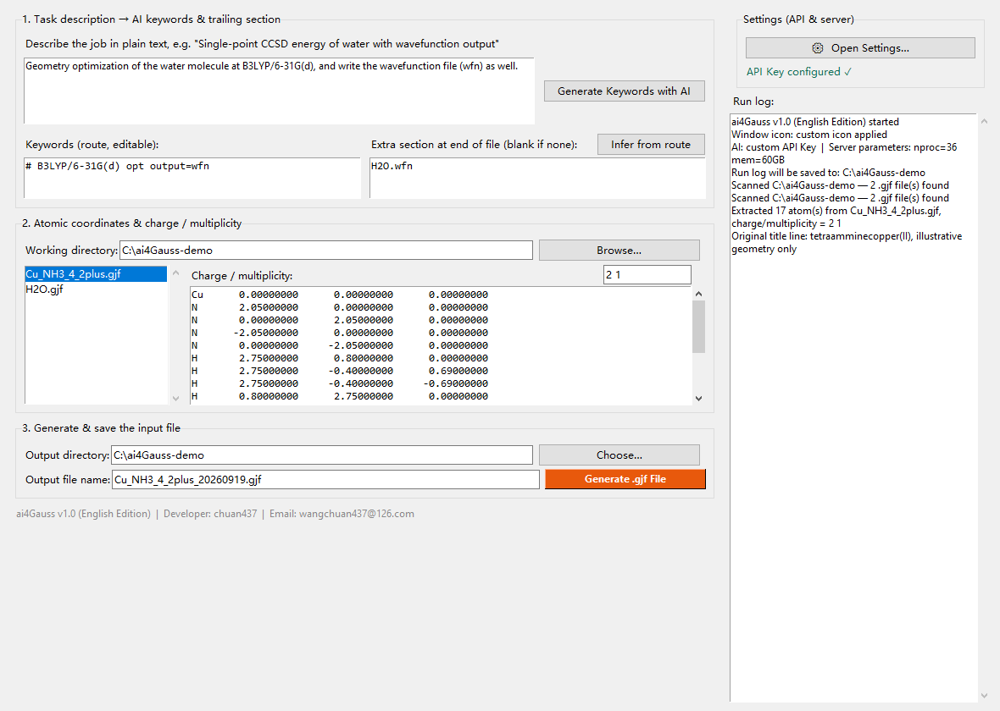

# ai4Gauss — Gaussian Input File Generator (English Edition)

> Describe your computational job in one sentence; get a properly formatted Gaussian input
> file (`.gjf`).

**English-only repository.** This is the standalone home of the English build. A bilingual
repository (Chinese + English) lives separately, and the Chinese build ships additional features
(see [Known limitations](#known-limitations)).



---

## What it is

`ai4Gauss` is a small tkinter desktop app (**Python standard library only**) for people who run
quantum chemistry calculations. You describe the job in plain English, an LLM writes the Gaussian
route section, and the program combines it with the atomic coordinates taken from an existing
`.gjf` file and with your server parameters (`%nproc` / `%mem`) into a complete, ready-to-submit
input file.

It exists because of three everyday annoyances:

1. **Nobody remembers route sections** — B3LYP or M06-2X? Which pseudopotential? Let the model
   propose one, and tell you why;
2. **The trailing section is easy to get wrong** — `output=wfn` requires the file name **on its own
   line after the coordinate block**; `gen` / `genecp` require a basis-set definition block. Miss one
   line and Gaussian stops with an error;
3. **Copy-pasting coordinates by hand is error-prone** — charge, multiplicity and 8-decimal
   formatting are easy to get wrong at 6 p.m.

## Features

| Feature | Description |
|---|---|
| **Two-step keyword generation** | Step 1 turns your description into the **route line** plus the reasoning behind it; step 2, given that route line, decides the **trailing section** (e.g. the `.wfn` file name required by `output=wfn`, or a `gen`/`genecp` block) |
| **Consistency check** | Route and trailing section are cross-checked and obvious gaps filled automatically; every fix or warning is logged. `gen`/`genecp` with an empty block is reported instead of guessed |
| **Coordinate extraction** | Reads charge/multiplicity and all atomic coordinates from an existing `.gjf`, reformatted to the standard 8-decimal layout; connectivity blocks are dropped on purpose |
| **Never overwrites** | Output names carry a date suffix (`input1_20260920.gjf`) |
| **Self-contained dialogs** | Custom-drawn message boxes with fixed English buttons, so the interface does not change with the system language |
| **Zero dependencies** | Standard library only (tkinter / urllib / json / re): just run `python src/ai4Gauss_en.py` |
| **No bundled credentials** | You supply your own OpenAI-compatible API key; nothing is routed through a third-party server |

## Quick start

### Run from source (recommended)

Python 3.8+ **with tkinter**, no third-party packages:

```bash
git clone https://github.com/wangchuan437/ai4Gauss-EN.git
cd ai4Gauss-EN
python src/ai4Gauss_en.py
```

On first run, click **⚙ Open Settings…** in the top-right panel and fill in:

| Field | What to enter |
|---|---|
| `%nproc` / `%mem` | CPU cores and memory written into the `.gjf` header, e.g. `36` / `60GB` |
| **API Key** | Your own key for any OpenAI-compatible endpoint |
| **Base URL** | Must end in `/v1`, e.g. `https://api.deepseek.com/v1` |
| **Model name** | e.g. `deepseek-v4-flash` |

> **No API key is bundled with this repository.** The status line stays red
> (*"No API Key — open Settings to add your own ✗"*) until you save one, and the program offers to
> open Settings for you at launch. Only **Generate Keywords with AI** needs a key — coordinate
> parsing and file generation work fully offline.

### Prebuilt executable

`ai4Gauss_en.exe` is a single-file, ~11.4 MB, 64-bit Windows build (no Python required).
It is **not** distributed in this repository — get it from the Releases page.

### Build your own exe

See [docs/BUILD.md](docs/BUILD.md) — a single PyInstaller command.

## Repository layout

```
.
├── src/
│   ├── ai4Gauss_en.py       the application
│   └── ai4Gauss_en.ico      window / application icon
├── docs/
│   ├── QuickStart.md        quick start (7 sections)
│   ├── UserGuide.md         full user guide (7 chapters, incl. troubleshooting)
│   └── BUILD.md             how to build a standalone exe
├── examples/
│   ├── inputs/              sample source files with coordinates
│   ├── outputs/             what the program produced from them
│   └── README.md
├── assets/                  interface screenshots
├── LICENSE                  CC BY-NC 4.0
├── CHANGELOG.md
└── README.md
```

At runtime the program reads and writes these files **in the folder of the script** (do not
commit them — `.gitignore` already excludes the first two):

| File | Contents |
|---|---|
| `ai4Gauss_en_config.json` | `nproc` / `mem` / your **API key** / base URL / model |
| `keywords.txt` | Timestamped log of every route line the AI produced |
| `<timestamp>.log` | Full run log, saved when you close the window |

## Examples

Two source files in `examples/inputs/` reproduce the results in `examples/outputs/`. Both outputs
were produced by **this** build, running against a real model — nothing was edited by hand except
the (illustrative) geometries.

| Source | Job description | Output | Demonstrates |
|---|---|---|---|
| `H2O.gjf` | Geometry optimization of water at B3LYP/6-31G(d), and also write the wavefunction file (wfn) | `H2O_opt_wfn.gjf` | `output=wfn` together with its trailing file name |
| `Cu_NH3_4_2plus.gjf` | Geometry optimization of [Cu(NH3)4]2+ with SDD for Cu and 6-31G(d) for N/H; a `genecp` section is required | `Cu_NH3_4_opt.gjf` | A `genecp` basis-set / pseudopotential definition block |

> The example geometries are illustrative only and were not optimized — do not use them for real jobs.
> `gen` / `genecp` blocks are model-generated: **always review them** before submitting.

See [examples/README.md](examples/README.md) for a walk-through of both.

## FAQ

**Does it need the internet?**
Only **Generate Keywords with AI** does. Coordinate parsing, parameter entry and file generation
all work offline, and you can always type the route line yourself.

**Is my API key safe?**
It is written to `ai4Gauss_en_config.json` in the program folder and is only ever sent to the
endpoint you configured (see `_post_chat()` in the source). **Do not commit that file.**

**Windows flags the app as malicious.**
A well-known false positive for PyInstaller single-file builds; add it to your trusted list.

**Why does the AI suggest such an expensive level of theory?**
It is a suggestion, not a peer-reviewed protocol. Read the rationale in the run log, then edit the
route line by hand — the extra section can be re-derived from it with **Infer from route**.

More answers (HTTP 401/403/404, coordinate parsing failures, no `.log` file) are in
[docs/QuickStart.md](docs/QuickStart.md) and [docs/UserGuide.md](docs/UserGuide.md).

## Known limitations

- The UI uses native tkinter widgets and has only been tested on Windows;
- Non-ASCII (e.g. Chinese) file names cause trouble for wavefunction/checkpoint files; the program
  falls back to ASCII names automatically;
- `gen` / `genecp` basis-set blocks are model-generated — **always review them** before submitting;
- This English build generates **one file at a time**. The Chinese build additionally offers batch
  generation over every `.gjf` in the working directory, and keeps its AI prompt in an external
  `system_prompt` field; the English build keeps its prompts in the source.

## License

[CC BY-NC 4.0](LICENSE) — free to use, modify and share with attribution,
**no commercial use**. Study, research and teaching require no permission.

## Contact

**Developer**: chuan437 · **Email**: <wangchuan437@126.com>

Issues, feature requests and "the keywords look wrong" reports are all welcome.
